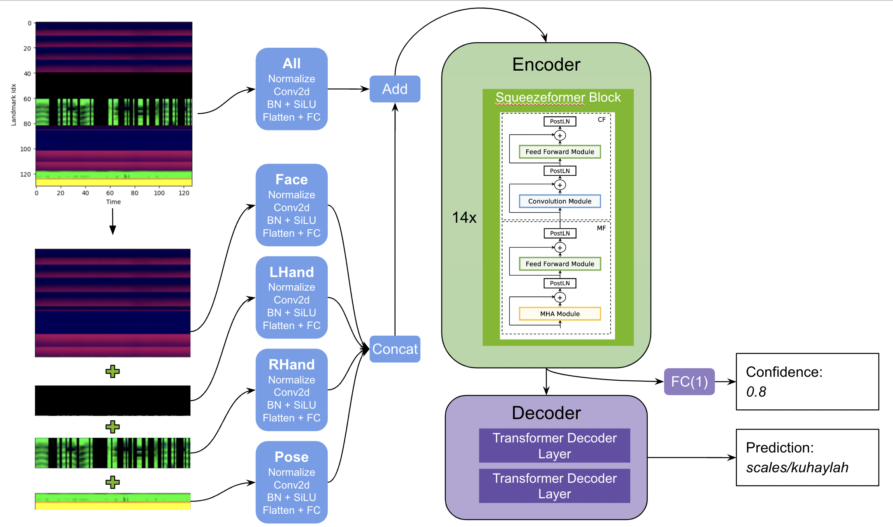

## Google - ASL Fingerspelling Recognition 1st place solution

This repository contains the codebase to reproduce the winning solution to the Google - ASL Fingerspelling Recognition competition on kaggle. 

Competiton website: [link](https://www.kaggle.com/competitions/asl-fingerspelling).  
1st place solution summary: [link](https://www.kaggle.com/competitions/asl-fingerspelling/discussion/434485). 

Our solution is based on a single encoder-decoder architecture. The encoder is a significantly improved version of Squeezeformer, where the feature extraction was adapted to handle mediapipe landmarks instead of speech signals. The decoder is a simple 2-layer transformer. We additionally predicted a confidence score to identify corrupted examples which can be useful for post-processing. We also introduced efficient and creative augmentations to regularize the model, where the most important ones were CutMix, FingerDropout and TimeStretch, DecoderInput Masking. We used pytorch for developing and training our models and then manually translated model architecture and ported weights to tensorflow from which we exported to tf-lite.




## Preparations

We used the `nvcr.io/nvidia/pytorch:23.07-py3` container from the [ngc catalog](https://catalog.ngc.nvidia.com/orgs/nvidia/containers/pytorch) to have a consistent environment between team members. You can run it via

`docker run --gpus all -it --rm nvcr.io/nvidia/pytorch:23.07-py3`

Within the container clone this repository and install necessary packages with 
```
git clone https://github.com/ChristofHenkel/kaggle-asl-fingerspelling-1st-place-solution
cd kaggle-asl-fingerspelling-1st-place-solution
pip install -r requirements.txt
```

We have preprocessed the dataset into numpy format files for fast loading. In order to download the data you will need a kaggle [user](https://www.kaggle.com/) and to set up the [kaggle-api](https://github.com/Kaggle/kaggle-api).
You can check the preprocessing of the data [here](https://www.kaggle.com/code/darraghdog/asl-fingerspelling-preprocessing-train) and [here](https://www.kaggle.com/code/darraghdog/asl-fingerspelling-preprocessing-supplemental). 

```
# Download the train and supplemental data
cd datamount/

kaggle datasets download -d darraghdog/asl-fingerspelling-preprocessing-train-dataset
unzip -n asl-fingerspelling-preprocessing-train-dataset.zip
rm asl-fingerspelling-preprocessing-train-dataset.zip
kaggle datasets download -d darraghdog/asl-fingerspelling-preprocessed-supp-dataset
unzip -n asl-fingerspelling-preprocessed-supp-dataset.zip 
mv supplemental_landmarks/* train_landmarks_npy/
rm asl-fingerspelling-preprocessed-supp-dataset.zip
rm -rf supplemental_landmarks/
cd ..
```

By default training is logged via neptune.ai to a quickstart project. If you want to use your own neptune project set `cfg.neptune_project` in `configs/cfg_1.py` and `configs/cfg_2.py`. A blog post discussing how we used neptune for this competition can be found [here](https://www.medium.com/@darragh.hanley_94135/mastering-mlops-with-neptune-ai-84e635d36bf2) . 


## Reproducing 1st place solution

In order to reproduce the 1st place solution, two rounds of training are necesseary. In the first round we train a smaller model in order to generate out-of-fold (OOF) predictions which are used as auxiliary target for round two. Finally, model architecture of round two is translated to tensorflow and weights are transfered before we export to a tf-lite model. Note that, for users convinience, we provide the output of step 1 as `datamount/train_folded_oof_supp.csv` so only step 2& 3 would need to be performed to get the final model weights.

      
### 1. Train round 1

Train 4 folds of cfg_1:

```
python train.py -C cfg_1
python train.py -C cfg_1 --fold 1
python train.py -C cfg_1 --fold 2
python train.py -C cfg_1 --fold 3
```

Add oof predictions from step 1. to train_folded.csv and concatenate with supplemental metadata:

```
python scripts/get_train_folded_oof_supp.py 
```

### 2. Train round 2

Train 2x fullfit seeds of cfg_2:

```
python train.py -C cfg_2 --fold -1
python train.py -C cfg_2 --fold -1
```

### 3. TF-Lite conversion

Transfer the resulting weights to a tensorflow equivalent ensemble model and export to tf-lite:

```
python scripts/convert_cfg_2_to_tf_lite.py  
```


The final model is saved under

```
datamount/weights/cfg_2/fold-1/model.tflite 
datamount/weights/cfg_2/fold-1/inference_args.json
```
and can be added to a kaggle kernel and submitted.


## References

We adapted squeezeformer components from these two great repositories: 

- SqueezeFormer (tensorflow) https://github.com/kssteven418/Squeezeformer
- SqueezeFormer (pytorch) https://github.com/upskyy/Squeezeformer/

Check out the SqueezeFormer [paper](https://arxiv.org/pdf/2206.00888.pdf) for more details on the architecture.

We copied and adapted the TFSpeech2TextDecoder from https://github.com/huggingface/transformers/ to support caching and used components related to LLama Attention.

## Paper 

TBD
      
      
      
